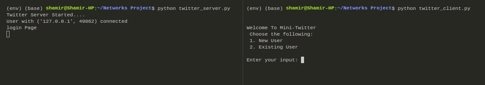
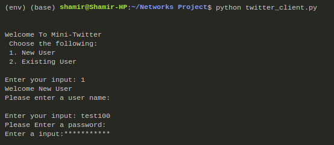
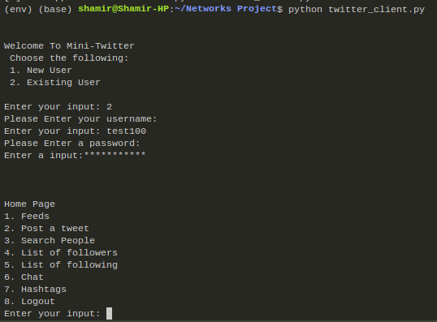
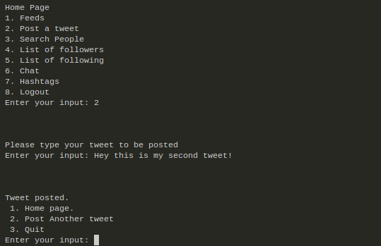
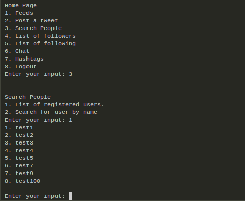
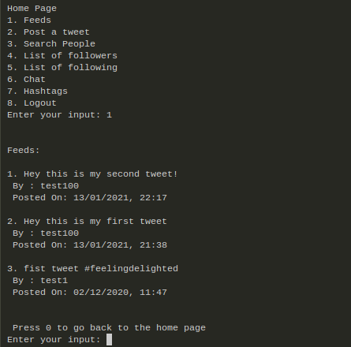
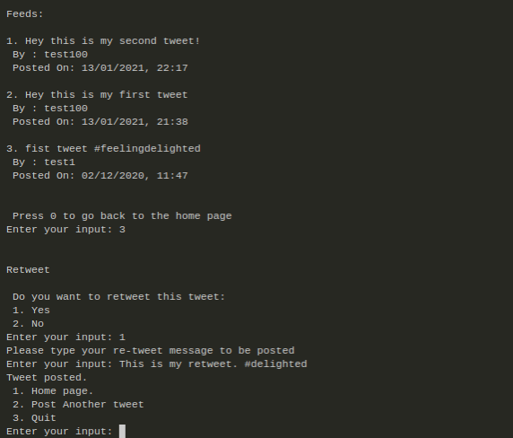
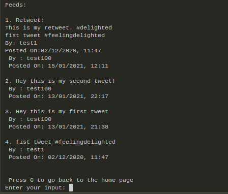

# Mini-Tweet :bird: <!-- omit in toc -->

 

Mini-Tweet is a server-client program which has similar functionalities of that of twitter. The program is implemented from scratch using python and runs using terminal. One programs act as a client while other act as server. TCP Protocol is used for making the connection.

---

## Contents <!-- omit in toc -->

- [1. Instructions 👨‍🏫](#1-instructions-)
  - [1.1 Requirements 🧾](#11-requirements-)
  - [1.2 Start Server 👨‍💻](#12-start-server-)
  - [1.3 Start Client](#13-start-client-man_in_tuxedo)
- [2. Features 🍨](#2-features-)
  - [2.1 Create a new account 🏦](#21-create-a-new-account-)
  - [2.2 Login and Logout 😆](#22-login-and-logout-)
  - [2.3 Post a tweet 🐦](#23-post-a-tweet-)
  - [2.4 Search People 👓](#24-search-people-)
  - [2.6 Follow/Unfollow User 🧑‍🤝‍🧑](#26-followunfollow-user-)
  - [2.7 Feeds 📰](#27-feeds-)
  - [2.8 Retweet 🐦🐦](#28-retweet-)


---

## 1. Instructions 👨‍🏫

Please follow the instruction to run the program successfully.

### 1.1 Requirements 🧾

The following libraries needs to be installed for the smooth functioning of the program.

```bash
 stdiomask
 crypt
 hmac
 pandas
```

### 1.2 Start Server 👨‍💻

The server can be serter by entering the following on a terminal.

 ```bash
    python twitter_server.py
 ```

### 1.3 Start Client

```bash
   python twitter_client.py
```

<p align="center">
  
</p>

## 2. Features 🍨

### 2.1 Create a new account 🏦

Once the user chooses the option 1 for new user. It gets a reply from server asking for a username and the respective password. It would ask to reenter the username, if the username already exist in the database. Thr password is masked to protect the privacy of the user.

<p align="center">
  
</p>

### 2.2 Login and Logout �

Once the user is registered. He/She can login using the option of existing user. The prompt asks for authentication. If the password and user is valid, the program would take the user to his/her homepage. At the homepage, the user can access various features of the program, which include viewing feeds, posting a tweet, search for people and follow them, to see who all are online and see the trending hashtags,etc.

<p align="center">
  
</p>

### 2.3 Post a tweet 🐦

User can post their tweet into the program by entering the tweet message after selecting the option 2. Users can include hashtags in their tweet, which would be used to see tweets based on hashtags and to list the top trending hashtags.

<p align="center">
  
</p>

### 2.4 Search People 👓

The registered users has the ability to see people who have registed and can follow their users to get the tweets from them. There are two options for searching, either the user could see the list of all the users who have registered or can search for a particular name in the search by name option.

<p align="center">
  
</p>

### 2.6 Follow/Unfollow User 🧑‍🤝‍🧑

Once the user sees other users either through the list of registered users or by searching by their name, the user can access the required user's home page by selecting the respective user's option. The user would be taken to the selected user's homepage. And there you would get an option of following and unfollowing a particular user.

<p align="center">
  
</p>

### 2.7 Feeds 📰

Feeds for a particular user displays all the tweets that the respective user had tweeted as well as the tweets by the people who he/she follows.

<p align="center">
  
</p>

### 2.8 Retweet 🐦🐦

If you want to retweet a particular tweet. Select the respective tweet by going to feeds. Then, choose the option for retweet. Add a message and post the tweet.

<p align="center">
  
</p>

An example of retweeted message:

<p align="center">
  
</p>


