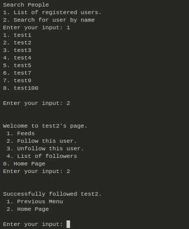

# Mini-Tweet :bird: <!-- omit in toc -->

 

Mini-Tweet is a server-client program which has similar functionalities of that of twitter. The program is implemented from scratch using python and runs using terminal. One programs act as a client while other act as server. TCP Protocol is used for making the connection.

---

## Contents <!-- omit in toc -->

- [1. Instructions 👨‍🏫](#1-instructions-)
  - [1.1 Requirements 🧾](#11-requirements-)
  - [1.2 Start Server 👨‍💻](#12-start-server-)
  - [1.3 Start Client :man_in_tuxedo:](#13-start-client-man_in_tuxedo)
- [2. Features](#2-features)
  - [2.1 Create a new account](#21-create-a-new-account)
  - [2.2 Login and Logout](#22-login-and-logout)
  - [2.3 Post a tweet](#23-post-a-tweet)
  - [2.4 Search People](#24-search-people)
  - [2.6 Follow/Unfollow User](#26-followunfollow-user)
  - [2.7 Feeds](#27-feeds)
- [3. How did we do it? 🤔](#3-how-did-we-do-it-)
  - [2.1 Create a new account](#21-create-a-new-account-1)
  - [2.2 Login and Logout](#22-login-and-logout-1)
    - [2.2.1 Masking Password](#221-masking-password)
  - [2.3 Post a tweet](#23-post-a-tweet-1)
  - [2.4 Viewing Feeds](#24-viewing-feeds)
  - [2.5 Retweet](#25-retweet)
  - [2.6 Look who all are online](#26-look-who-all-are-online)
- [4. Future Scope](#4-future-scope)

---

## 1. Instructions 👨‍🏫

Please follow the instruction to run the program successfully.

### 1.1 Requirements 🧾

The following libraries needs to be installed for the smooth functioning of the program.

```bash
 stdiomask
 crypt
 hmac
 pandas
```

### 1.2 Start Server 👨‍💻

The server can be serter by entering the following on a terminal.

 ```bash
    python twitter_server.py
 ```

### 1.3 Start Client :man_in_tuxedo:

```bash
   python twitter_client.py
```


## 2. Features 

### 2.1 Create a new account


### 2.2 Login and Logout


### 2.3 Post a tweet


### 2.4 Search People


### 2.6 Follow/Unfollow User



### 2.7 Feeds


## 3. How did we do it? 🤔

### 2.1 Create a new account

### 2.2 Login and Logout

#### 2.2.1 Masking Password

### 2.3 Post a tweet

### 2.4 Viewing Feeds

### 2.5 Retweet

### 2.6 Look who all are online

## 4. Future Scope